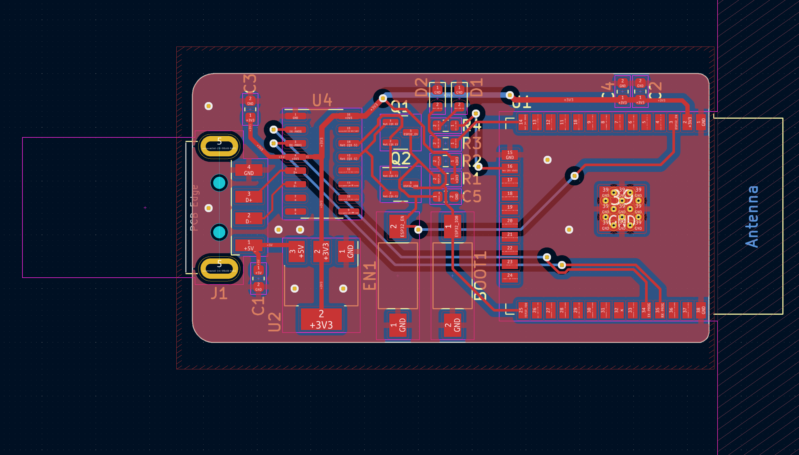

# ESP32 USB STICK

Thank you to [PCBWay](https://www.pcbway.com/) for sponsorship the PCB production of this prototype.

## FIRST VIDEO -> [VIDEO](https://www.youtube.com/shorts/jlbQPXkQsWg)

| GPIO  | LED |
| ------------- | ------------- |
| IO12  | D1  |
| IO13  | D2  |

### PCB BY PCBWAY

### 3D VIEW

### PCB VIEW

### SCHEMATIC VIEW

Thank you to [PCBWay](https://www.pcbway.com/) for sponsorship this project by covering the cost of PCB production for beta. The boards turned out very nicely. The black solder mask looks solid and the grills holes is perfect.